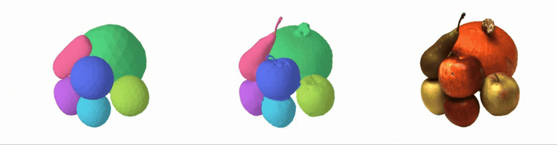
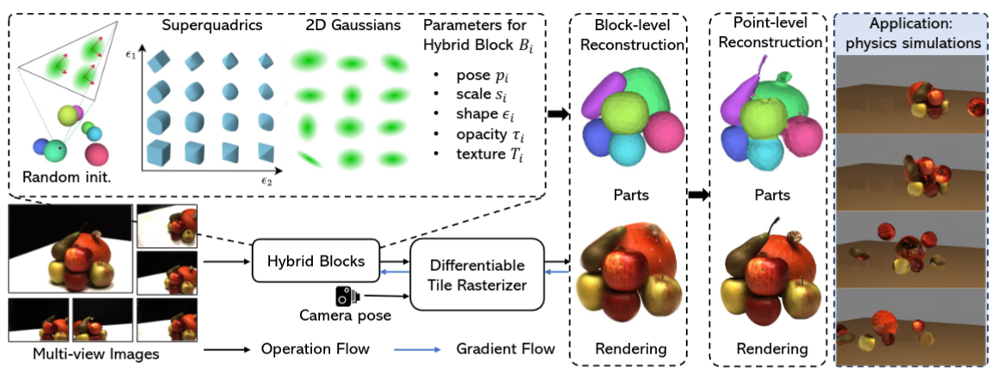
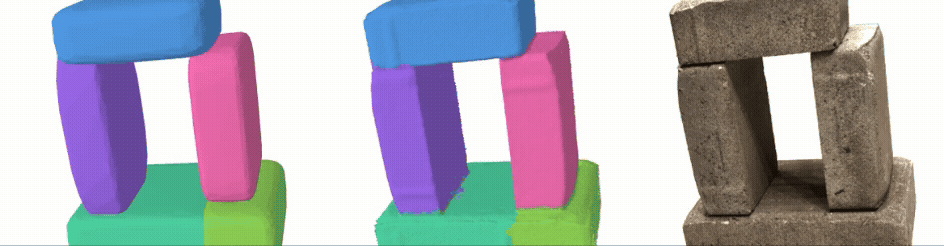
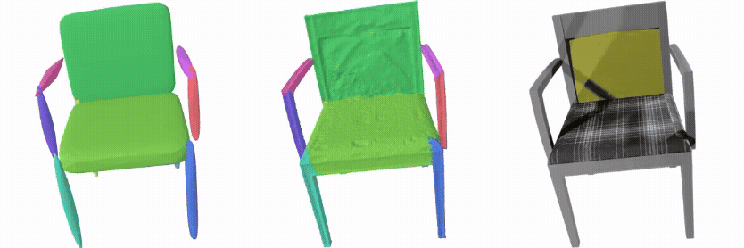
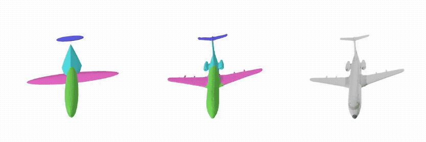
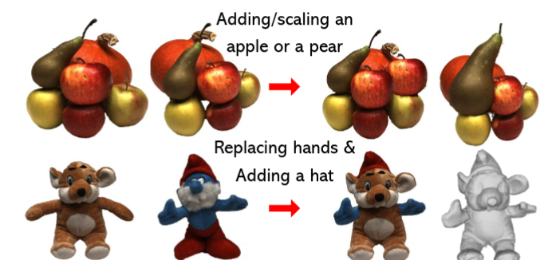

# [ICCV 2025] PartGS

<h2 align="center">

Self-supervised Learning of Hybrid Part-aware 3D Representation
of 2D Gaussians and Superquadrics

[Zhirui Gao](https://scholar.google.com/citations?user=IqtwGzYAAAAJ&hl=zh-CN), 
[Renjiao Yi](https://renjiaoyi.github.io/), 
[Huang Yuhang](https://scholar.google.com/citations?user=OAULSygAAAAJ&hl=zh-CN), 
[Wei Chen](https://openreview.net/profile?id=~Wei_Chen35),  [Chenyang Zhu](https://www.zhuchenyang.net/), [Kai Xu](https://kevinkaixu.net/)

[](https://arxiv.org/abs/2408.10789)
[](https://zhirui-gao.github.io/PartGS/)
[](https://zhirui-gao.github.io/PartGS/)

<p>
    
</p>

<p align="center">
<span style="font-size: 12px">
PartGS enables both the block-level and point-
level part-aware reconstructions,  preserving both part decomposition and reconstruction precision.
</span>
</p>


<p>
    
</p>

</h4>

This repository contains the official implementation of the paper: [Self-supervised Learning of Hybrid Part-aware 3D Representation
of 2D Gaussians and Superquadrics](https://arxiv.org/abs/2408.10789), which is accepted to ICCV 2025.
PartGS is a self-supervised part-aware reconstruction framework that integrates 2D Gaussians and superquadrics to
parse objects and scenes into an interpretable decomposition, leveraging multi-view image inputs to uncover 3D structural
information.

If you find this repository useful to your research or work, it is really appreciated to star this repository✨ and cite our paper 📚.

Feel free to contact me (gzrer2018@gmail.com) or open an issue if you have any questions or suggestions. We are currently working on an expanded version. If you're interested, feel free to discuss with us.


## 🔥 See Also

You may also be interested in our other works:
- [**[ICCV 2025] CurveGaussian**](https://zhirui-gao.github.io/CurveGaussian/):  A novel bi-directional coupling framework between parametric curves and edge-oriented Gaussian components, enabling direct optimization of parametric curves through differentiable Gaussian splatting.

- [**[TCSVT 2025] PoseProbe**](https://github.com/zhirui-gao/PoseProbe): A novel approach of utilizing everyday objects commonly found in both images and real life, as pose probes, to tackle few-view NeRF reconstruction using only 3 to 6 unposed scene images.


- [**[CVMJ 2024] DeepTm**](https://github.com/zhirui-gao/Deep-Template-Matching): An accurate template matching method based on differentiable coarse-to-fine correspondence refinement, especially designed for planar industrial parts.


## 📢 News
- **2025-06-27**: The paper is available on arXiv.
- **2025-06-26**: PartGS is accepted to ICCV 2025.


## 📋 TODO

- [x] **2025-07-10**: Release the training and evaluation code.
- [ ] Release the ShapeNet dataset and training configure


## 🔧 Installation

```
# download
git clone https://github.com/zhirui-gao/PartGS.git
```
### if you have an environment used for 3dgs, use it.

you just need install [2dgs surfel-rasterization](https://github.com/hbb1/2d-gaussian-splatting/tree/main) submodule:
```
pip install submodules/diff-surfel-rasterization
```
[Optional] IF you want to render part map in our point-level optimization stage, you should install diff-surfel-rasterization_part, more detials are introduced [here](https://github.com/zhirui-gao/diff-surfel-rasterization_part)
```
pip install submodules/diff-surfel-rasterization_part
```
### if not, create a new environment
```
conda env create --file environment.yml
conda activate partgs
```


## 🚀 Usage

### Training


To train a scene of block-level recon, simply use
```
python train.py -s <path to  dataset>  -m <path to save>  -r 4 --training_type block --data_type dtu 
```

To train a scene of point-level recon(block-first), simply use
```
python train.py -s <path to  dataset> -m <path to save>  -r 4 --training_type part --data_type dtu  --quiet  --depth_ratio 1.0 --lambda_dist 1000
```
Commandline arguments for regularizations
```
--lambda_normal  # hyperparameter for normal consistency
--lambda_distortion # hyperparameter for depth distortion
--depth_ratio # 0 for mean depth and 1 for median depth, 0 works for most cases
```

To train a scene full recon, use
```
python train.py -s <path to  dataset> -m <path to save>  -r 4 --training_type all --data_type dtu  --quiet  --depth_ratio 1.0 --lambda_dist 1000
```

### Testing
Bounded Mesh Extraction

To export a mesh within a bounded volume, simply use


```
python render.py -m <path to pre-trained model> -s <path to dataset> 
```

Commandline arguments you should adjust accordingly for meshing for bounded TSDF fusion, use

```
--depth_ratio # 0 for mean depth and 1 for median depth
--voxel_size # voxel size
--depth_trunc # depth truncation
```

### Full evaluation
We provide scripts to evaluate our method of novel view synthesis and geometric reconstruction.

```
python scripts/dtu_eval.py --dtu <path to the preprocessed DTU dataset>   \
     --DTU_Official <path to the official DTU dataset>  \
     --output_path  <path to save training results>
```


## 📊 Dataset

### DTU
For reconstruction on DTU dataset, we used the same processed dataset as 2DGS, please download the preprocessed data from [Drive](https://drive.google.com/drive/folders/1SJFgt8qhQomHX55Q4xSvYE2C6-8tFll9) or [Hugging Face](https://huggingface.co/datasets/dylanebert/2DGS). You also need to download the ground truth [DTU point cloud](https://roboimagedata.compute.dtu.dk/?page_id=36).


### BlendedMVS

For reconstrction on [BlendedMVS](https://github.com/YoYo000/BlendedMVS), it can download from [here](https://www.dropbox.com/scl/fo/um3wj3ctiuoottbfmqmgb/ABZRltszDvWHJ824UL6DHw0?rlkey=3vjok0aivnoiaf8z5j6w05k92&e=1&dl=0), privoided by [Neus](https://github.com/Totoro97/NeuS?tab=readme-ov-file).

### ShapeNet and Self-capture dataset
To be released.


## 👀 Visual Results


### DTU Dataset
<p align="center">
    
    

</p>

### ShapeNet Dataset 

<p align="center">
    
    
</p>


## 👊 Application


### Editing
<p align="center">
    
</p>

## Simulation
<p align="center">
    
</p>


## ⭐ Acknowledgements


This project is built upon [GaMeS](https://github.com/waczjoan/gaussian-mesh-splatting) and [2DGS](https://github.com/hbb1/2d-gaussian-splatting/tree/main).  We thank all the authors for their great repos!

## 📚 Citation
If you find our work helpful, please consider citing:
```bibtex
@misc{gao2025selfsupervisedlearninghybridpartaware,
      title={Self-supervised Learning of Hybrid Part-aware 3D Representation of 2D Gaussians and Superquadrics}, 
      author={Zhirui Gao and Renjiao Yi and Yuhang Huang and Wei Chen and Chenyang Zhu and Kai Xu},
      year={2025},
      eprint={2408.10789},
      archivePrefix={arXiv},
      primaryClass={cs.CV},
      url={https://arxiv.org/abs/2408.10789}, 
}

```
---

